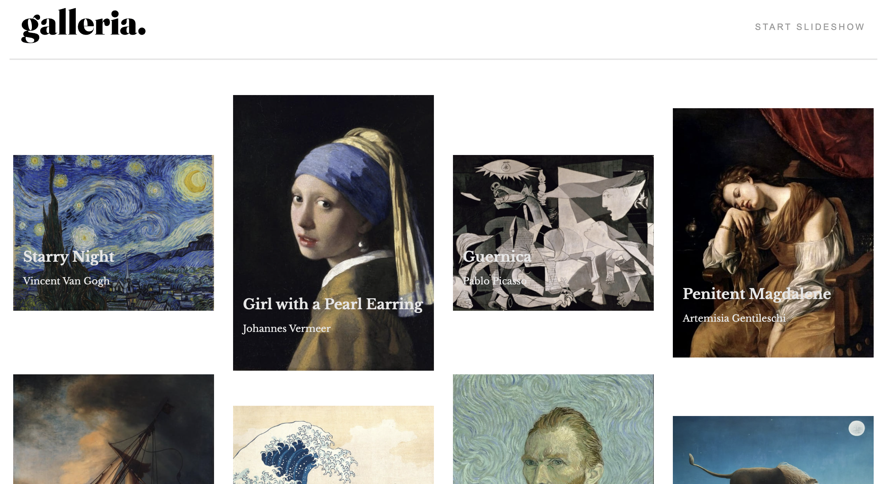
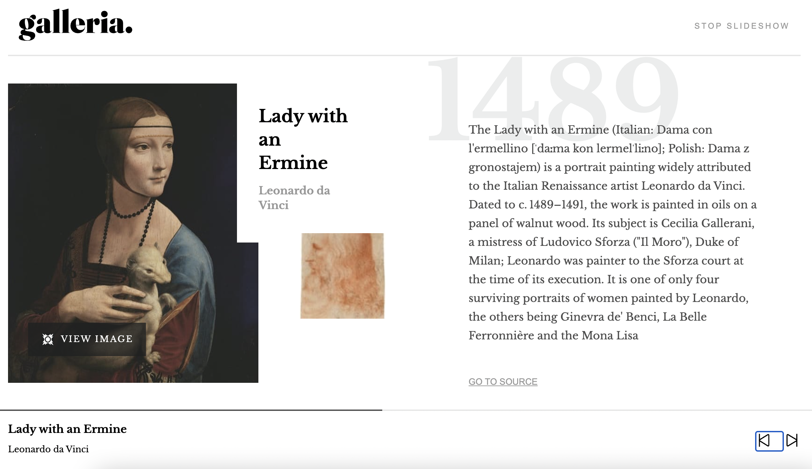
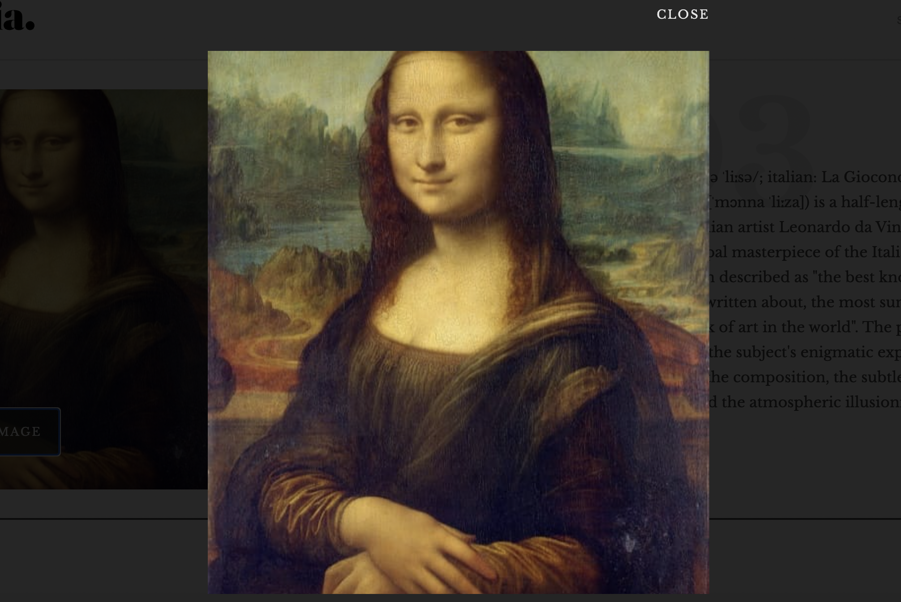

## Galleria slideshow site // Frontend Mentor Project // React and CSS

- [see project](https://sweta-galleria-slideshow-site-fm.netlify.app/slider)
- The users should be able to:
  - View the optimal layout for the app depending on their device's screen size
  - See hover states for all interactive elements on the page
  - Navigate the slideshow and view each painting in a lightbox

    

 

    

 

    

 

#### Comments about the code

#### Helpers
